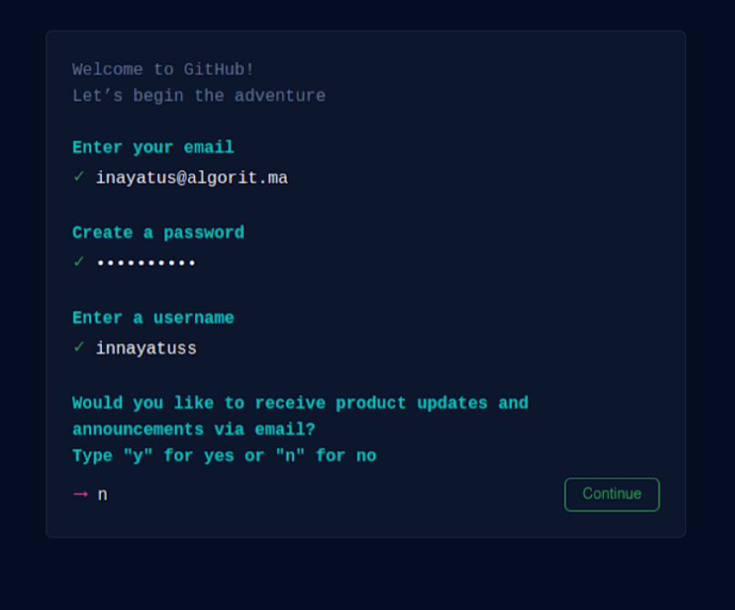
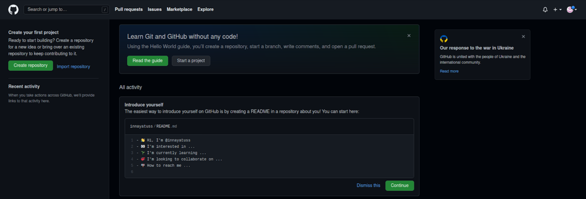

# Algoritma Community

A community to [ask questions](https://github.com/teamalgoritma/community/discussions) and participate in discussions relating to data science, R/Python programming and working with data in general.

Komunitas untuk pemula maupun yang telah berpengalaman dalam data science untuk berdiskusi terkait data science, R/Python programming, dan data. Silahkan bergabung!

# Table of Content

* [Community Moderators](https://github.com/teamalgoritma/community#community-moderators)
* Join the Discussion:
    - [Create GitHub Account](https://github.com/teamalgoritma/community#create-github-account)
    - [How to Ask & Discuss](https://github.com/teamalgoritma/community#how-to-ask--discuss)

## Community Moderators 

- Samuel Chan ([@onlyphantom](https://github.com/onlyphantom))
- Nabiilah Ardini Fauziyyah ([@NabiilahArdini](https://github.com/NabiilahArdini))
- David Limbong ([@Davidlimbong](https://github.com/Davidlimbong))

## Join the Discussion

Untuk bertanya dan mengikuti diskusi di Algoritma Community, kamu harus memiliki akun GitHub dan mengikuti panduan cara bertanya di Algoritma Community! Berikut panduannya:

### Create GitHub Account

1. Akses alamat https://github.com/
2. Klik tombol "Sign up" dan akan muncul halaman sebagai berikut:


3. Masukkan alamat email, password, username, serta apakah ingin berlangganan info terkait produk GitHub. Lalu silahkan klik tombol "Continue".

<center>  </center>

3. Verifikasi akun Anda dengan memilih gambar yang tepat. Apabila sudah selesai, silahkan klik "Create account".

<center>  </center>

4. Buka akun email Anda kemudian lakukan verifikasi dengan memasukkan kode verifikasi.

<center>  </center>

5. Ketika akun Anda sudah terverifikasi, maka akan muncul tampilan untuk personalisasi GitHub Anda. Jika ingin mengaturnya nanti, silahkan klik "Skip personalization".


6. Pembuatan github Anda sudah selesai dan akan muncul halaman sebagai berikut.:



### How to Ask & Discuss

Algoritma memiliki **GitHub Algoritma Community** berupa platform untuk Student bertanya terkait pertanyaan teknikal (code/error/aplikasi data science). Pertanyaan Student dapat dijawab oleh Mentor ataupun Student lainnya. Hal ini diharapkan membantu Student selama memperdalam/melakukan review materi, membiasakan kultur *sharing*, *peer-to-peer learning*, dan aktif dalam komunitas data science!

Berikut adalah **cara bertanya**:

1. Sign in pada akun GitHub
2. Masuk ke [GitHub Algoritma Community - Discussion](https://github.com/teamalgoritma/community/discussions)


3. Klik **"New Discussion"**
4. Ajukan pertanyaan pada kolom yang disediakan:

    a. Isi poin/judul pertanyaan/error  
    
    b. Isi detail pertanyaan/error
    
    c. Select Category > QnA
    
    d. Klik "Start Discussion"
    
Tips bertanya efektif: Ceritakan permasalahan secara umum terlebih dahulu sebelum melampirkan code/poin pertanyaan. Lampirkan pula code yang digunakan serta error message yang dihasilkan. Masukan bagian code/error di antara tanda backtick ` ``` `.

<center>  </center>

5. Pertanyaan/diskusi telah terbuka:


6. Jawaban akan diberikan oleh Mentor/Student lain pada kolom **"Write"** di bagian bawah suatu diskusi. 


Diskusi untuk tiap jawaban dapat terus dilanjutkan dengan memberikan komentar pada jawaban tersebut. Sedangkan saran jawaban baru dapat dibuat pada kolom Write yang baru.


7. Bila ada solusi yang dapat menjawab pertanyaan Anda, silahkan klik "Mark as answer" pada jawaban tersebut. Pertanyaan telah terjawab.


